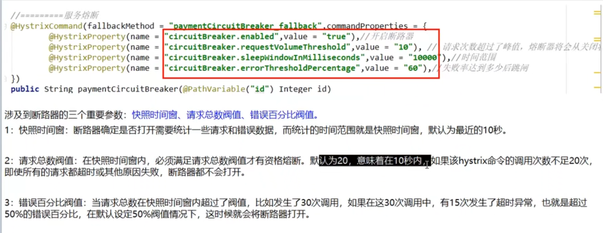

# SpringCloudDemo
自学springCloud

**************************************************服务注册中心**************************************************

###########Eureka#################
服务端pom.xml
       <!--eureka-server-->
        <dependency>
            <groupId>org.springframework.cloud</groupId>
            <artifactId>spring-cloud-starter-netflix-eureka-server</artifactId>
        </dependency>
 客户端pom.xml     
        <dependency>
            <groupId>org.springframework.cloud</groupId>
            <artifactId>spring-cloud-starter-netflix-eureka-client</artifactId>
        </dependency>    
        
  客户端主方法注解：@EnableEurekaClient
                  @EnableDiscoveryClient  //该注解用于向使用consul或者zookeeper作为注册中心时注册服务
  服务端主方法注解：@EnableEurekaServer
        
        
单机版
server:
  port: 7001

eureka:
  instance:
    hostname: eureka7001.com        #eureka服务端的实例名称
  client:
       #  false表示不向注册中心注册自己。
     register-with-eureka: false
       #false表示自己端就是注册中心，我的职责就是雄护服务实例，并不需要去检察服务
     fetch-registry: false
     serviceUrl:
       defaultZone: http://eureka7001.com:7001/eureka

集群版：
修改host文件
在底部新增
127.0.0.1        eureka7001.com
127.0.0.1        eureka7002.com

application.yml
server:
  port: 7001

eureka:
  instance:
    hostname: eureka7001.com        #eureka服务端的实例名称
  client:
       #  false表示不向注册中心注册自己。
     register-with-eureka: false
       #false表示自己端就是注册中心，我的职责就是雄护服务实例，并不需要去检察服务
     fetch-registry: false
     serviceUrl:
       defaultZone: http://eureka7002.com:7002/eureka
#  server:
#    enable-self-preservation: false
#    eviction-interval-timer-in-ms: 2000
#       defaultZone: http://eureka7002.com:7002/eureka
application.yml
server:
  port: 7002

eureka:
  instance:
    hostname: eureka7002.com        #eureka服务端的实例名称
  client:
    #  false表示不向注册中心注册自己。
    register-with-eureka: false
    #false表示自己端就是注册中心，我的职责就是雄护服务实例，并不需要去检察服务
    fetch-registry: false
    serviceUrl:
      defaultZone: http://eureka7001.com:7001/eureka
      
      
      
      
      
      
###########zookeeper#################
消费者客户端pom
       <dependency>
            <groupId>org.springframework.cloud</groupId>
            <artifactId>spring-cloud-starter-zookeeper-discovery</artifactId>
            <!--先排除自带的zookeeper3.5.3-->
            <exclusions>
                <exclusion>
                    <groupId>org.apache.zookeeper</groupId>
                    <artifactId>zookeeper</artifactId>
                </exclusion>
            </exclusions>
        </dependency>
        <!--添加zookeeper3.4.9版本-->
        <dependency>
            <groupId>org.apache.zookeeper</groupId>
            <artifactId>zookeeper</artifactId>
            <version>3.4.14</version>
        </dependency>
        <dependency>
        
        
        
        
        
        
        
        
application.yml
#服务别名---注册zookeeper.注册中心名称
spring:
  application:
    name: cloud-consumerzk-order
  cloud:
    zookeeper:
      connect-string: 腾讯云服务器外网IP:2181
      
      
      
      
      
      
 ##########consul##############
 
 consul自带ribbon,可以使用restTamplte调用接口
 
 public class OrderConsulController {
    public static final String INVOKE_URL = "http://consul-provider-payment";

    @Autowired
    private RestTemplate restTemplate;
    @GetMapping(value = "consumer/payment/consul")
    public String payment(){
        String result = restTemplate.getForObject(INVOKE_URL+"/payment/consul",String.class);
        return  result;
    }
}

application.yml
 spring:
  application:
    name: consul-consumer-order
  ##consul注册中心地址
  cloud:
    consul:
      host: localhost
      port: 8500
      discovery:
        #hostname: 127.0.0.1
        service-name: ${spring.application.name}

**********服务调用**********
**OpenFeign**
客户端主方法增加注解：@EnableFeignClients
                service接口增加注解：@Component
                                                            @FeignClient(value = "微服务名称")

例：
        `@Component
        @FeignClient(value = "cloud-provider-hystrix-payment")
        public interface PaymentHystrixService {
            @GetMapping("/payment/hystrix/ok/{id}")
            public String paymentInfo_Ok(@PathVariable("id") Integer id);
        
            @GetMapping("/payment/hystrix/timeout/{id}")
            public String paymentInfo_TimeOut(@PathVariable("id") Integer id);
        }`

***********************************Hystrix***********************************
**Hystrix--服务降级->fallback**

服务器忙，请稍后再试，不让客户端等待并立刻返回一个友好提示
哪些情况会出发降级?
程序运行异常
超时
服务熔断触发服务降级
线程池/信号量打满也会导致服务降级

客户端：
配置文件：
feign:
    hystrix:
        enabled: true

接口加注解和兜底方法：
@HystrixCommand(fallbackMethod = "paymentTimeOutFallBackMethod",commandProperties = {
@HystrixProperty(name="execution.isolation.thread.timeoutInMilliseconds",value="1500")
})
public String paymentTimeOutFallBackMethod(Integer id) {
return"我是消费者80，对方支付系统繁忙请10秒钟后再试或者自己运行出错请检查自己，o(T_T)o";
}
主方法增加@EnableCircuitBreaker注解

服务端：
主方法增加@EnableCircuitBreaker注解
接口加注解和兜底方法：
@HystrixCommand(fallbackMethod = "paymentTimeOutFallBackMethod",commandProperties = {
@HystrixProperty(name="execution.isolation.thread.timeoutInMilliseconds",value="1500")
})
//无论上述方法超时或是异常报错，皆会走此方法！
public String paymentInfo_TimeOutHandler(Integer id) 
{
        return "线程池："+Thread.currentThread().getName() + "   系统繁忙或者运行报错，请稍后再试！";
    }

优化：
    1.设置全局fallback
类加注解
@DefaultProperties(defaultFallback = "payment_Global_FallbackMethod")
如果设定
@HystrixCommand(fallbackMethod = "paymentTimeOutFallBackMethod",commandProperties = {
@HystrixProperty(name="execution.isolation.thread.timeoutInMilliseconds",value="1500")
})则走设置的方法
如果只设置了@HystrixCommand
则走全局的fallback
    2.增加方法
        public String payment_Global_FallbackMethod(){
             return "Global异常处理信息，请稍后再试，/(ToT)/~";
        }

**Hystrix--服务熔断->break**
类比保险丝达到最大访问后，直接拒绝访问，拉闸限电，然后调用服务降级的方法，并返回友好提示！

**Hystrix--服务限流->flowLimit**
秒杀高并发等操作，严禁一窝蜂的过来拥挤，大家排队，一秒N个，有序进行